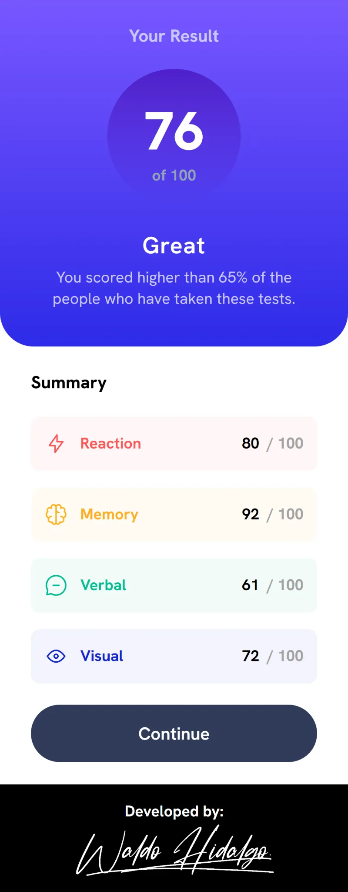
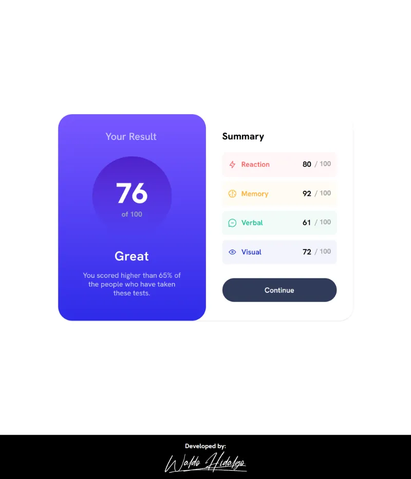
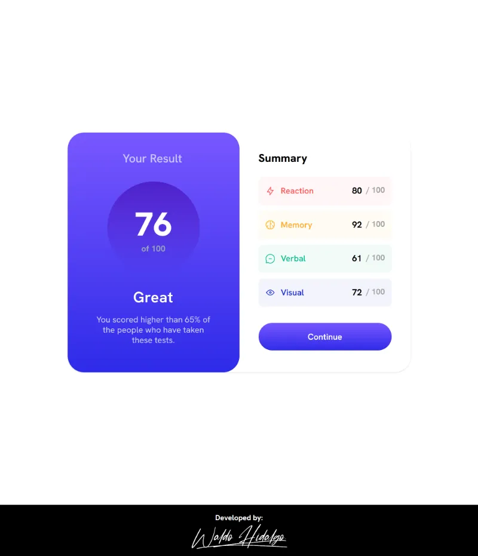

# Results summary component

Repositorio con el código solución al proyecto: [Results summary component challenge on Frontend Mentor](https://www.frontendmentor.io/challenges/results-summary-component-CE_K6s0maV).

## Tabla de Contenidos

- [Results summary component](#results-summary-component)
  - [Tabla de Contenidos](#tabla-de-contenidos)
  - [The challenge](#the-challenge)
  - [Diseño a replicar](#diseño-a-replicar)
    - [1. Mobile Design](#1-mobile-design)
    - [2. Desktop Design](#2-desktop-design)
    - [3.Active States Design](#3active-states-design)
  - [Screenshots de mi Proyecto Realizado](#screenshots-de-mi-proyecto-realizado)
    - [1. Mobile Size](#1-mobile-size)
    - [2. Desktop Size](#2-desktop-size)
    - [3.Active States](#3active-states)

## The challenge

El desafío consiste en realizar lo siguiente:

> Your challenge is to build out this results summary component and get it looking as close to the design as possible.
>
> You can use any tools you like to help you complete the challenge. So if you've got something you'd like to practice, feel free to give it a go.
>
> We provide the data for the results in a local `data.json` file. So you can use that to add the results and total score dynamically if you choose.
>
> Your users should be able to:
>
> - View the optimal layout for the interface depending on their device's screen size
> - See hover and focus states for all interactive elements on the page
> - **Bonus**: Use the local JSON data to dynamically populate the content

He realizado todos los desafíos.

## Diseño a replicar

Las siguientes imagenes son entregadas por Front End Mentor para replicar tales diseños a nivel pixel perfect:

### 1. Mobile Design

### 2. Desktop Design

### 3.Active States Design

## Screenshots de mi Proyecto Realizado

### 1. Mobile Size

### 2. Desktop Size

### 3.Active States

